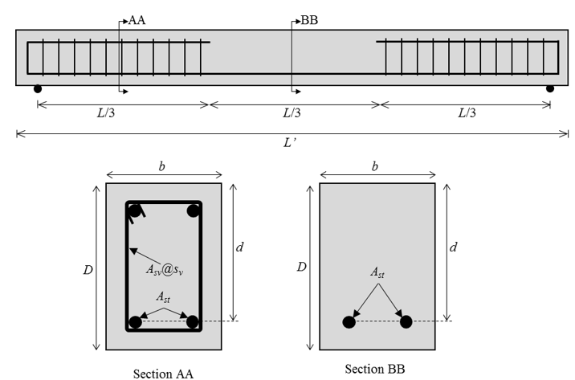
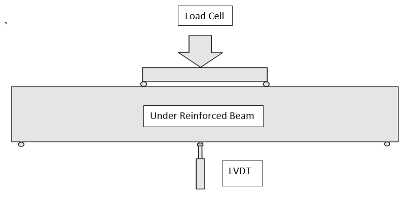

<h4>Basic Guidelines For Conducting The Experiment</h4>
The beam section shown below is prepared for experimenting-
 

 
Recommended values for beam specimen:
 Steel grade		= Fe500
 Concrete grade	= M20
 L’ 	= 2000 mm
 L	= 1800 mm
 b 	= 150 mm
 D 	= 200 mm
 Ast	= 2-12φ
 Asv 	= 2 legged 6φ
 sv 	= 100 mm c/c
 d 	= 168 mm (20 mm nominal cover)
 
 
<h4>Specimen Details:</h4>
 a)	Beam specimen – 1 nos.
  b)	Concrete cubes (150 mm) for compressive strength test – 3 nos.
  c)	Rebar, same as used in beam specimen – 600 mm (approx.) for tensile strength test.

 <h4> Instrumentation:</h4>
<ul>
  <li>A LVDT is provided at the center of the UR beam during testing. This measures the displacements at the center of the beam.</li>
  <li>Load cells are connected to the hydraulic jack, which in turn applies load on the beam.</li>
  <li>The beam is tested using a four-point loading setup.</li>
</ul>
 

 

<h4>Procedure:</h4>
<ul>
 <li>Determine the compressive strength of concrete: To obtain the mean strength of concrete, cast three cube specimens along with the beam and test them in CTM at the time of testing of the beam and take their sample mean ultimate strength as mean strength (refer to the test to determine compressive strength of concrete for more details).</li>
<li>Determine tensile strength of steel reinforcement: To obtain the mean yield strength of rebars, perform a tensile test of three rebar specimens at the time of testing of the beam and take their sample mean yield strength as mean yield strength (refer to the test to determine the tension strength of rebar).</li>
<li>
To study the flexural behavior of reinforced concrete beam:</li>
1.	Make reinforced concrete beam formwork with given reinforcement details. Pour concrete into the formwork, compact it with a needle vibrator, and finish the top surface. Remove the formwork after 24 hours and put the beam in water for curing.
 2.	At the time of testing, take the beam specimen out of the water and wipe it with a cloth for surface dry conditions.
 3.	Place the specimen on the loading setup. Ensure an acceptable contact between the specimen and loading points. Install the loading arrangement along with the load cell.
 4.	One dial gauge is installed at the middle of the beam to measure the deflection of the beam.
 5.	Measure and note the depth (D), width (b), and effective length (L) of the beam before starting the experiment.
 6.  The load is applied slowly at a uniform rate at 5 kN load increments using a hydraulic jack.
 7.	As the cracks appear on the beam, stop increasing the load and mark the cracks.
 8.	Note the value of deflection reading at various loads till failure.
 9.      Increase the load till the failure occurs and then note the failure load.

<h4>Observations and Calculations</h4>
Grade of concrete (fck)                         =
 Mean compressive strength of concrete (fcm)     =
 Grade of steel (fy)                             =
 Mean Yield strength of steel (fym)              =
 Area of tension steel (Ast)                     =
 Length of Beam Between Supports (L)             =
 Depth of Beam (D)                               =
 Width of Beam (b)                               =
 Young’s Modulus of steel(Es)                   =
 <table>
<thead>
  <tr>
    <th>&nbsp;&nbsp;&nbsp; PROPERTY&nbsp;&nbsp;&nbsp;</th>
    <th>&nbsp;&nbsp;&nbsp; OBSERVED (EXPERIMENTAL) ULTIMATE MOMENT&nbsp;&nbsp;&nbsp;</th>
    <th>&nbsp;&nbsp;&nbsp; DESIGN (IS-456) ULTIMATE MOMENT&nbsp;&nbsp;&nbsp;</th>
  </tr>
</thead>
<tbody>
  <tr>
    <td>    Strucural Material Strength   </td>
    <td>    Concrete                0.67fcm =      Steel                       fym   = </td>
    <td>    Concrete                0.67fck =      Steel                     fy =          </td>
  </tr>
  <tr>
    <td>    Strucural Material Strength with Factor of Safety(FOS)         </td>
    <td>    Concrete                0.67fcm =      Steel                       fym   = </td>
    <td>    Concrete                0.446fck =      Steel                     0.87fy =          </td>
  </tr>
  <tr>
    <td>Limiting Depth of Neutral Axis </td>
    <td> xu,max,predicted / d = 0.0035 / ( 0.0055 + fym/Es ) = </td>
    <td> xu,max,design / d = 0.0035 / ( 0.0055 + 0.87fym/Es ) = </td>
  </tr>
  <tr>
    <td>Depth of Neutral axis</td>
    <td>xu,predicted = fymAst / 0.54fcmb =   (xu <= x u,max,predicted)</td>
    <td>xu,design = 0.87fyAst / 0.362fckb =   (xu <= x u,max,design)</td>
  </tr>
  <tr>
    <td>&nbsp;&nbsp;&nbsp;   &nbsp;&nbsp;&nbsp; Ultimate Moment&nbsp;&nbsp;&nbsp;</td>
    <td>    MuR,prediced =   0.54 fcmbxu(d   – 0.416xu )                                   OR     MuR,prediced = fymAst(d –   0.416xu   )     MuR,prediced =     </td>
    <td>     MuR,Design = 0.362fckbxu(d − 0.416xu )                            OR          MuR,Design = 0.87fyAst(d −   0.416xu   )      MuR,Design =     </td>
  </tr>
</tbody>
</table>
 <b>Failure (experimental) Load(P)                   =</b> 
 <b>Failure (experimental) Moment (Mu,experimental )          </b>          =   PL/6   = 
 <b>Model Error (predicted)</b>  = Mu,predicted / Mu,predicted</li>
 <b>Model Error (observed)</b>  = Mu,experimental / Mu,predicted</li>
</ul>

<h4>Results:</h4>
<ol>
<li><b>Model Error (predicted)</b>  = </li>
<li><b>Model Error (observed)</b>  = </li>
<li>The Load vs displacement curve obtained from the experiment is :</li>
</ol>

<h4>Precautions:</h4>
<ol>
<li>Before casting, ensure the beam section is under-reinforced.</li>
<li>Mix design calculations before preparing concrete for casting should be accurate.</li>
<li>Ensure compaction of the beam is done properly, to obtain accurate test results.</li>
<li>Testing must be done after a minimum of 28 days.</li>
<li>Before testing the beam, check if the load cell, hydraulic jet and LVDTs are connected properly.</li>
<li>Wear safety helmets while marking the cracks on the beam.</li>
</ol>
  
