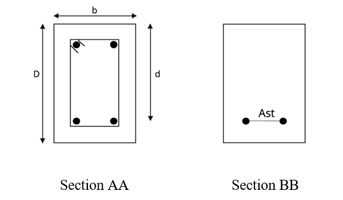
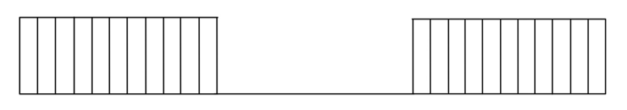

<h4>Basic Guildelines For Conducting The Experiment</h4>
The beam section shown below is prepared for casting and conducting the experiment-
Dimensions of the beam  = L’*b*D  = ( 2000x150x200 )mm3
 

 

 
  The reinforcement cage is  a system of reinforcement bars used in strengthening the concrete structures. The reinforcement cage used in our experiment is shown below-                                                  

 

 
Cover is the distance between the directly exposed concrete surface to the nearest reinforcement bar.. The cover provided in our experiment is about 25mm.
Before casting the beam, the reinforcement cage is prepared.  The cage and cover blocks are then placed in the casting mold. The mold is then filled with concrete and finished using a vibration needle and other necessary equipment. The casted beam is then allowed to set and demoulded once it sets. The beam is then cured for around 28 days. Three cube and three flexure beam specimens are also casted along with the UR beam. 
Before starting the experiment, some additional information is required from various other experiments. The properties and their requirements are listed below -

<ul></ul>

<h4>Results</h4>
<ol>
<li>The model error in the experiment is :</li>
<li>The Load vs displacement curve obtained from the experiment is :</li>
</ol>

<h4>Precautions</h4>
<ol>
<li>Before casting, ensure the beam section is under-reinforced.</li>

<li>Mix design calculations before preparing concrete for casting should be accurate.</li>

<li>Ensure compaction of the beam is done properly, to obtain accurate test results.</li>

<li>Testing must be done after a minimum of 28 days.</li>

<li>Before testing the beam, check if the load cell, hydraulic jet and LVDTs are connected properly.</li>

<li>Wear safety helmets while marking the cracks on the beam.</li>
</ol>
  
