<h4>Terminology</h4> 
The following symbols are used in the experiment -

L’ = overall length of the beam 
 
L	= length of the beam between outer supports 
 
b	= width of the beam 
 
D	= depth of the beam 
 
d	= effective depth of the beam 
 
Ast 	= area of steel in tension 
 
Igs	= moment of inertia considering gross section 
 
Its	= moment of inertia considering transformed section 
 
fym	= mean yield strength of steel 
 
fcm	= mean compressive strength of concrete 
 
fcr	= flexural strength of concrete 
 
Es	= elastic modulus of steel (around 200GPa)
 
Ec	= elastic modulus of concrete (=5000√fcm) 

m	= modular ratio (Es/Ec) 

P	= applied load 

M	= bending moment because of applied load 

y	= depth of centroidal axis 

xu	= depth of neutral axis 

 
<h4>Behaviour of Flexure Members</h4>
 
Structural elements like beams and slabs frequently experience flexure or bending when they are transversely loaded. Columns and walls that experience eccentric stress, lateral pressures, and/or lateral displacements also encounter flexure. Flexure typically happens in combination with transverse shear, though it can also happen with torsion and axial compression, among other structural actions. In this experiment, the behaviour of an UR beam subjected to pure flexure is studied. Pure flexure condition in achieved using a four-point loading setup and is discussed late
Beams are divided into two categories based on the presence of tension and compression steel -
 

 
<ol>
<li>Singly Reinforced Beam ( see Fig. 1 (A) ) 
 
The beam section that has steel only on the tension side is known as singly reinforced beam.
</li>
<li>
Doubly Reinforced Beam ( see Fig. 2 (B) )
The beam section that has steel on the tension as well as compression side is known as a doubly reinforced beam.
</li>
</ol>

Based on area of tension steel, the beam section is divided into three categories -
<ol>
<li>Balanced Section : The area of tension steel is such that the two limiting conditions (yielding of steel and crushing of concrete) are reached simultaneously. </li>
<li>Under Reinforced (UR) Section: The area of tension steel is such that the beam fails by yielding of tension steel followed by crushing of concrete. </li>
<li>Over Reinforced (OR) Section: The area of tension steel is such that the beam fails due to crushing of concrete.
</li>
</ol>
 

 
The moment at which the first crack appears in a beam is known as the "cracking moment" of the beam section(Mcr).

OR beams experience a sudden brittle failure due to crushing of concrete. The moment at which crushing of concrete takes place and the beam experiences a sudden failure is known as the “Ultimate Moment of failure(Mur)” for an OR beam section. Fig(A) represents the moment-curvature curve for an OR beam section.

UR beams failure also occur due to crushing of concrete. This crushing is achieved after yielding of tension steel. The moment at which tension steel yields, is known as the yielding moment of an UR beam. The maximum moment that a beam can withhold, before its failure due to crushing of concrete is known as Ultimate moment of failure of an UR beam. Fig(A) represents the moment-curvature curve for an UR beam section.

 
<h4>Analysis of an UR Section</h4>
 
<ol>
<li><b>Uncracked Phase in an UR section</b>
 
This phase has extremely small loads. In this phase, concrete can carry tensile forces. Stress strain curves of concrete are linear in nature in this phase
 

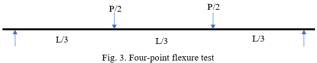

 
This relationship stays the same until the load reaches a certain limit, at which point the moment is the same as the beam's cracking moment.
The moment at which the first crack appears in a beam is known as the "cracking moment" of the beam section. Now, we will calculate the cracking moment for various sections
<b>Calculation of cracking Moment for a gross section</b>
Let us first calculate the cracking moment and the corresponding curvature for a beam section made up of only concrete.
 

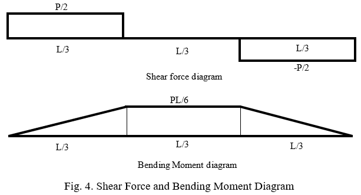

   
 
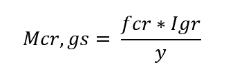

  
 <b>Calculation of cracking Moment for a transformed section</b>
 A reinforced beam section, can be analysed better if we analyse the entire structure by considering it to be a block of concrete only. This can be done by converting the steel area into concrete by using the concept of modular ratio(m). Modular ratio is defined as the ratio of Young’s modulus of steel to that of concrete. The transformed area of steel is taken to be (m-1)Ast as shown in the figure.
 The neutral axis of a section is the axis lying in the cross section of the  beam, about which the longitudinal stresses (tensile as well as compressive) are zero. 
   
 
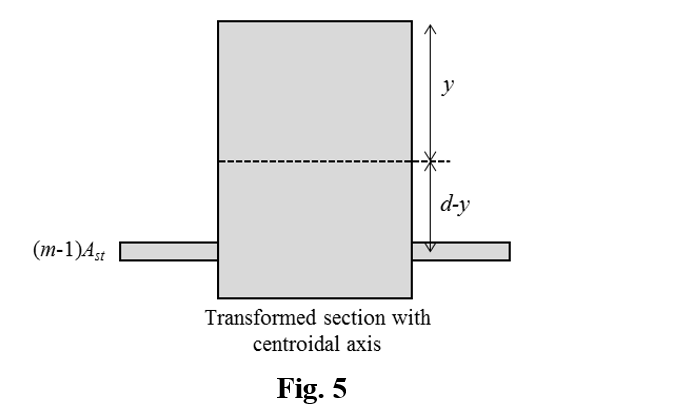

  
               The neutral axis of a section is the axis lying in the cross section of the  
              beam, about which the longitudinal stresses (tensile as well as
              compressive) are zero.  The depth of neutral axis can be obtained by   
             balancing the moment about top of the section -

   
 

  
 The cracking moment for a transformed section can be obtained from the following equation -
   
 
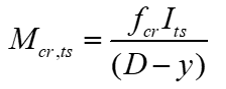

  
  
</li>
 
 
<li><b>Cracked Phase of an UR section ( Yield Stress )</b>
 After the cracking moment is achieved, the effective concrete section is reduced as shown in the given figure-
   
 
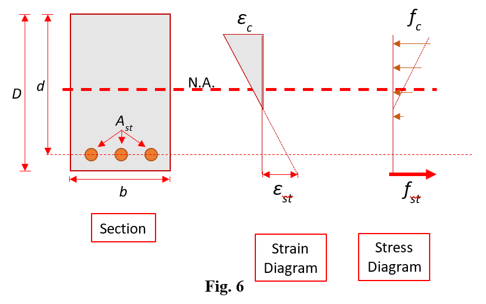

  
 This phase represents cracked phase of the section with linear stress strain curves. The linear behaviour sustains only at very low compressive strains. The phase continues till the moment in the section reaches a certain value, known as the yielding moment of the section.
 
 <b>Calculation of yielding moment</b>
 The moment in the section at which the tension steel yields is known as the yielding moment of the section. The stress strain relationships at the yielding moment are shown below. We will analyse the section given below-
   
 
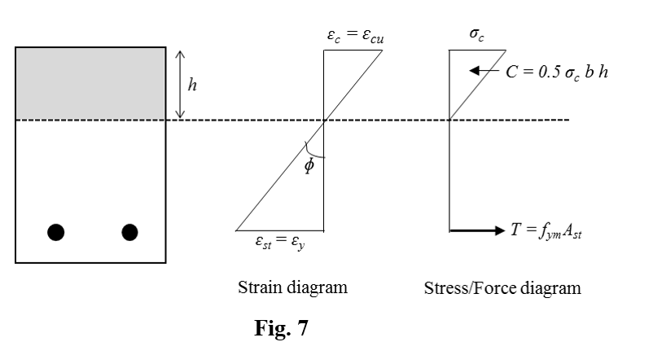

  
 At yielding moment, the stress in steel is equal to the yielding moment of steel(fym).
By using stress strain relationships, 
          Stress in concrete(εc) = Ec*εc
Balancing the tension and compression forces and using similarity relationships, we get the following results-
  
 
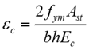

  
   
 
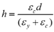

  
 The yielding moment for the given section is calculated using the given formula-
   
 
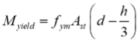

  
 </li>
<li><b>Cracked Phase of an UR section ( Ultimate Limit State )</b>
 This phase is known as the ‘Limit State of Collapse’ or ‘Ultimate Limit State’.
Before going into details of this phase, let us first see some of the basic assumptions for this zone-
<ul>
 <li>The relationship between the compressive stress distribution in concrete and the strain in concrete may be assumed to be rectangle, trapezoid, parabola or any other shape which results in prediction of strength in substantial agreement with the results of the test, An acceptable stress-strain curve is the one that we are using. For design purposes, the compressive strength of concrete in the structure shall be assumed to be 0.67 times the characteristic strength. The partial safety factor γm = 1.5 shall be applied in addition to this. For our stress-strain curve, the design stress block parameters are-
Area of stress block                                               =  0.36fck*xu
Depth of centre of compressive force from          = 0.42 xu
extreme fibre in compression
</li>
 <li>The tensile strength of concrete is ignored.</li>
 <li>The stresses in the reinforcement are derived from representative stress-strain curve for the type of steel used. For design purposes the partial safety factor γm = 1.15 shall be applied.</li>
 <li>(d)	The maximum strain in the tension reinforcement in the section at failure shall not be less than 
  
  fy / 1.15Es + 0.002
   
  These assumptions are for design of a structure. 
 </li> 
 </ul>
 In this phase, the stress relationship is non-linear. However as per our assumption, the strain relationships are linear in nature. We cannot use the concept of transformed section to determine the depth of neutral axis in this case.
  
The stress-strain relationships in Limit state of collapse or ULS can be shown as -
  
 
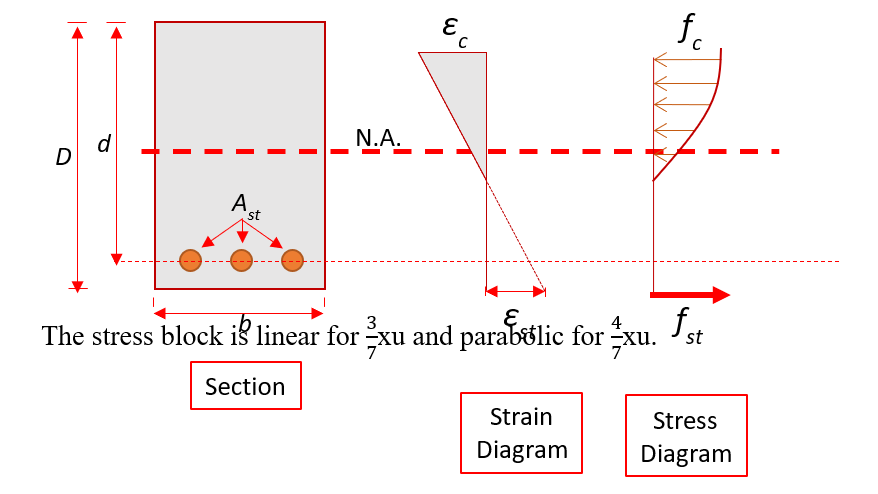

  
 The stress block is linear for 3/7xu and parabolic for 4/7xu. 

  
 
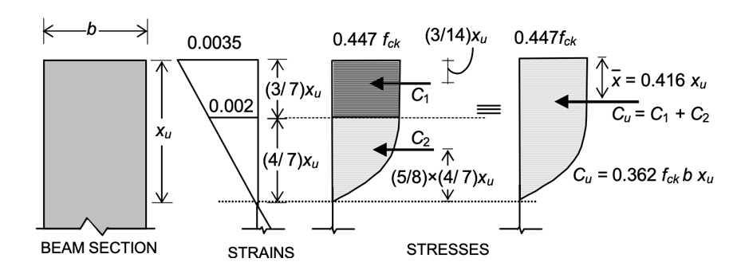

  
Area of the block(rectangle + parabola)                  =  0.36fck*xu

Balancing the forces in the rectangular and parabolic areas, we have

Depth of centre of compressive force from          = 0.42 xu
extreme fibre in compression

The net force for the concrete section = 0.362fckbxu
The stress-strain curves for experimental and theoretical calculations for steel and concrete are -
 
  
 
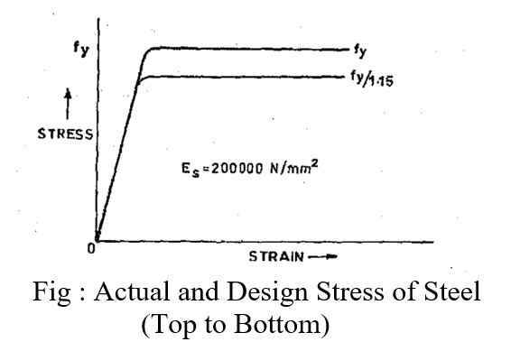

  
 
  
 
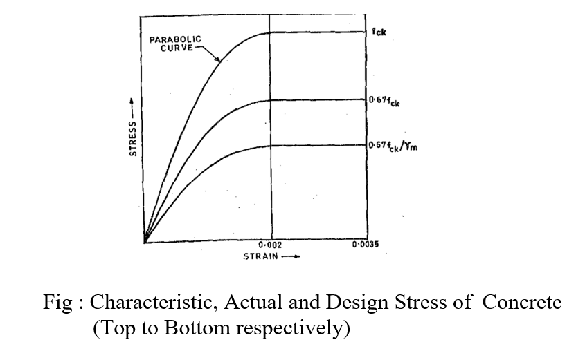

  
 </li>
</ol>
<h4> Calculation of ultimate Moment for Theoretical and Experimental Calculations                                      
</h4>
We don’t use FOS for the experimental calculations, so that we can test them for real life situations. The following table lists down various parameters for experimental and theoretical calculations-
<table>
<thead>
  <tr>
    <th>&nbsp;&nbsp;&nbsp; PROPERTY&nbsp;&nbsp;&nbsp;</th>
    <th>&nbsp;&nbsp;&nbsp; ACTUAL(EXPERIMENTAL) ULTIMATE MOMENT&nbsp;&nbsp;&nbsp;</th>
    <th>&nbsp;&nbsp;&nbsp; DESIGN(THEORETICAL) ULTIMATE MOMENT&nbsp;&nbsp;&nbsp;</th>
  </tr>
</thead>
<tbody>
  <tr>
    <td>    Material Strength   </td>
    <td>    Concrete                0.67fcm     Steel                       fym   </td>
    <td>    Concrete                0.67fck     Steel                     fy         </td>
  </tr>
  <tr>
    <td>    Factor of Safety(FOS)         </td>
    <td>    Not applicable   </td>
    <td>    Concrete                 1.5     Steel                        1.15   </td>
  </tr>
  <tr>
    <td>    Design/Actual Stress   </td>
    <td>    Concrete                  0.67fcm     Steel                         fym   </td>
    <td>    Concrete                 0.446fck     Steel                       0.87fy   </td>
  </tr>
  <tr>
    <td>Limiting Depth of Neutral Axis </td>
    <td> xu,max / d = 0.0035 / ( 0.0055 + fym/Es )</td>
    <td> xu,max / d = 0.0035 / ( 0.0055 + 0.87fym/Es )</td>
  </tr>
  <tr>
    <td>Depth of Neutral axis</td>
    <td>xu = fymAst / 0.54fcmb&nbsp;&nbsp;(xu <= x u,max)</td>
    <td>xu = 0.87fyAst / 0.362fckb  (xu <= x u,max)</td>
  </tr>
  <tr>
    <td>&nbsp;&nbsp;&nbsp;   &nbsp;&nbsp;&nbsp; Ultimate Moment&nbsp;&nbsp;&nbsp;</td>
    <td>    Mu =   0.54 fcmbxu(d   – 0.416xu )                                   OR     Mu = fymAst(d –   0.416xu   )         </td>
    <td>     Mu = 0.362fckbxu(d − 0.416xu )                            OR           Mu = 0.87fyAst(d −   0.416xu   )          </td>
  </tr>
</tbody>
</table>

