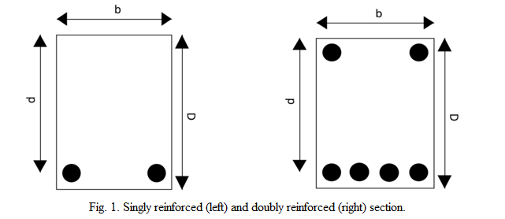

<h4>Background:</h4>
 
Reinforced concrete (RC) beams are structural elements that carry transverse external loads. The loads cause bending moments, shear forces, and sometimes torsion across their length. Moreover, concrete is strong in compression and very weak in tension. Thus, steel reinforcement is used to take up tensile stresses in RC beams. 
 

 
Beams are divided into two categories based on the presence of tension and compression steel -
<ol>
<li>Singly Reinforced Beam ( see Fig. 1 (A) ) 
 
A beam section with steel only on the tension side is a singly reinforced beam.
</li>
<li>
Doubly Reinforced Beam ( see Fig. 1 (B) )
A beam section with steel on the tension and compression side is known as a doubly reinforced beam.
</li>
</ol>
Further, beam sections are divided into three categories based on the area of tension steel -
<ol>
<li>Balanced Section: The area of tension steel is such that the two limiting conditions (yielding of steel and crushing of concrete) are reached simultaneously. </li>
<li>Under Reinforced (UR) Section: The area of tension steel is such that the beam fails by yielding of tension steel followed by crushing of concrete. </li>
<li>Over Reinforced (OR) Section: The area of tension steel is such that the beam fails due to the crushing of concrete.  </li>
</ol>
Fig. 2 shows the moment-curvature curve for an UR and OR beam section. OR beams show a sudden brittle failure due to the crushing of concrete. The behaviour of UR beams is ductile.
 

 
As per the limit state design method given in IS-456, the design ultimate moment of resistance of an UR section is given by:
 Mur,design = 0.36fckbxu(d-0.416xu)
 where
 xu = (0.87fyAst) / (0.362fckb)  < xu,max
 and where
 xu,max / d = 0.0035 / ( 0.0055 + 0.87fy/Es ) 

 The predicted ultimate moment of resistance of a UR section is given by setting the values of factors of safety for both concrete and steel equal to 1.0 and by considering the observed (mean) strength of concrete and steel instead of the characteristic values. With this, the predicted ultimate moment of resistance of an UR section is given by:
 Mur,predicted = 0.54fcmbxu(d-0.416xu)
 where
 xu = (fy,mAst) / (0.54fcmb)  < xu,max,predicted
 and where
 xu,max,predicted / d = 0.0035 / ( 0.0055 + fym/Es ) 

 In the above equation:
 b	= width of the beam 
 D	= depth of the beam 
 d	= effective depth of the beam 
 Ast 	= area of steel in tension 
 fym	= mean yield strength of steel 
 fy	= characteristic yield strength of steel 
 fcm	= mean compressive strength of concrete 
 fck	= characteristic compressive strength of concrete 
 Es	= elastic modulus of steel (= 200 GPa)
 xu	= depth of neutral axis 
 xu,max	= limiting depth of neutral axis 
 Mur,design = design ultimate moment of resistance
 Mur,predicted = predicted ultimate moment of resistance
 Mur,observed = observed (experimental) ultimate moment of resistance

